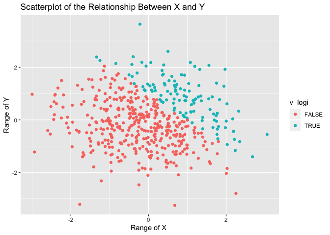
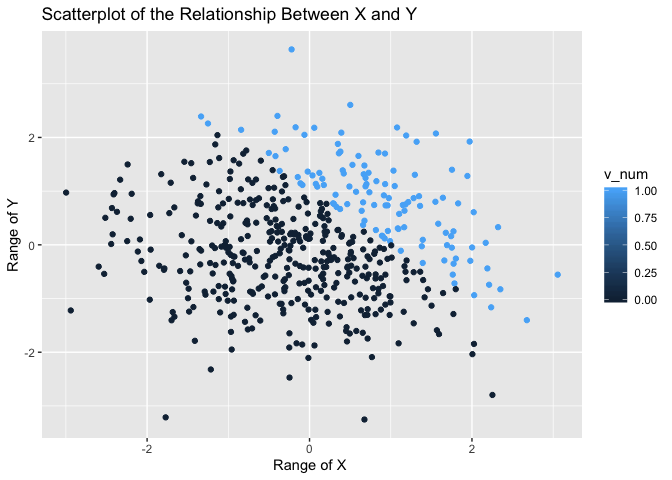
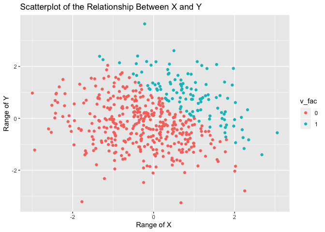

p8105\_hw1\_kw2873
================
Keyi Wang
9/13/2019

I’m an R Markdown document\!

# problem 1: datafram

``` r
  set.seed(12) 
  s = rnorm(8)
  v_logi = s > 0
  v_ch = c("yellow", "blue", "green", "red","black", "white", "gray", "purple")
  v_fac = factor(c("AB", "B", "O", "B","B", "O", "AB", "B"),
                 levels = c('AB','B','O'))
  example_df = tibble(
  samp = s,
  vec_logical = v_logi,
  vec_char = v_ch,
  vec_factor = v_fac
  )
### using the as.numeric function
numeric_logi = as.numeric(v_logi)
numeric_ch = as.numeric(v_ch)
```

    ## Warning: NAs introduced by coercion

``` r
numeric_fac = as.numeric(v_fac)
```

Both logic vector and factor vector can be transformed into numeric
vector but factor vector failed to do so. For logic vecor, R recognize
True as 1 , False as 0. Therefore, when we use the as.numeric function,
R can easily take True as 1 and False as 0. Smilarly,factor vector has
level which can be recognized by R as 1,2,3 and so on. Therefore,
as.numeric fucntion can be applied here sucessfully. However, R can not
recognize character vector as numeric factor.

When it comes to taking the mean of these vectors: the mean of my sample
is -0.6242112. the mean of my logical vector is 0.125, the mean of my
character vector is NA and the mean of my character vector is NA. As
mentioned before, since R take True and False as 1 and 0, we can take
the mean of logical vector. Since R can not recognize factor and
charactor as numeric vectors, we can not take mean from it.

# **problem 1 continued**

``` r
### vector convertion using as.numeric function
new_logi1 = as.numeric(v_logi)
new_logi2 = as.factor(v_logi)
result1 = new_logi1*s
result2 = new_logi2*s
```

    ## Warning in Ops.factor(new_logi2, s): '*' not meaningful for factors

``` r
new_logi3 = as.numeric(new_logi2)
result3 = new_logi3*s
```

# problem 2

``` r
### creating dataframe for making boxplot
set.seed(1)
x = rnorm(500)
library(tidyverse)
plot_df = tibble(
  x = rnorm(500),
  y = rnorm(500),
  v_logi = x + y > 1,
  v_num = as.numeric(v_logi),
  v_fac = as.factor(v_num),
)
new_logi = pull(plot_df,v_logi) ### pulling out the data from dataframe in order to 
                                ### calculate for the proportion                                          
```

In this dataplot, the number of rows is 500 the number of colon is 5 the
mean, meadian, and standard deviation of x are 0.0226441, -0.0367783,
1.0239989 respectively. And the proportion for cases for which x+y\>1 is
117/ 500

# problem 2 continued with making plots

``` r
ggplot(plot_df, aes(x = x, y = y, color = v_logi)) + geom_point() 
```

<!-- -->

``` r
ggsave("scatterplot1.png")
```

    ## Saving 7 x 5 in image

``` r
ggplot(plot_df, aes(x = x, y = y, color = v_num)) + geom_point()
```

<!-- -->

``` r
ggplot(plot_df, aes(x = x, y = y, color = v_fac)) + geom_point()
```

<!-- -->
